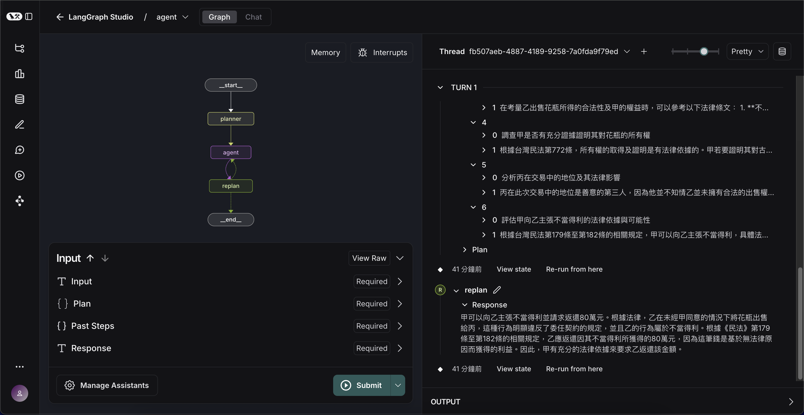

# Taiwan CivilCode Agent

此專案目標為嘗試在 AgentFlow 中應用 CoT 來增進小模型的法規問題推理能力。

Jupyter Notebook Version [1223-MultiHop-RAG](https://github.com/hank1224/DataTeam-RAG-training/tree/main/1223-MultiHop-RAG).

Preview Workflow: [LangSmith Log](https://smith.langchain.com/public/801b3911-1617-41c3-86d4-050e740c4732/r)

## TODO

1. Use [LangGraph multi-agent Network](https://langchain-ai.github.io/langgraph/how-tos/#multi-agent) to replace `ThreadPoolExecutor` in [nodes.py: execute_parallel()](src/taiwan_civilcode_agent/nodes.py)

2. Build the Knowledge Graph of CivilCode for searching.

3. 把解題關鍵納入考慮，判例、法條修改歷史...等，也就是領域知識，進而修改架構。

## Data

民法全文（110-01-20版本），條文編號：1~1125，總計共1439筆。[全國法規資料庫 - 民法](https://law.moj.gov.tw/LawClass/LawAllPara.aspx?pcode=B0000001)

資料清洗過程詳見：[資料清洗.md](https://github.com/hank1224/DataTeam-RAG-training/tree/main/1223-MultiHop-RAG/data-pre-process)

## Evaluation

使用國考選擇題考題，選用 `113年公務人員特種考試司法人員、法務部調查局調查人員及海岸巡防人員考試` 之選擇題部分。

考題需與當時的民法版本相符，此問題已被考慮並且已選用適合的版本。

- 民法：110-01-20 修訂版本
- 試卷：113年